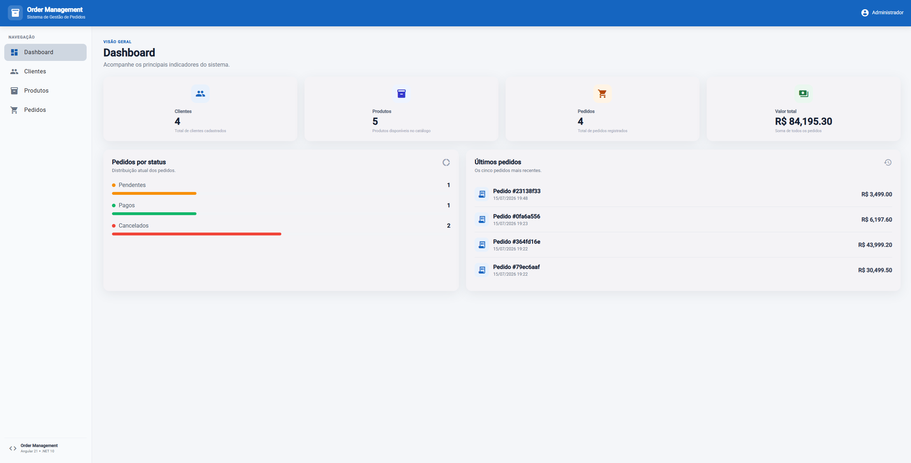
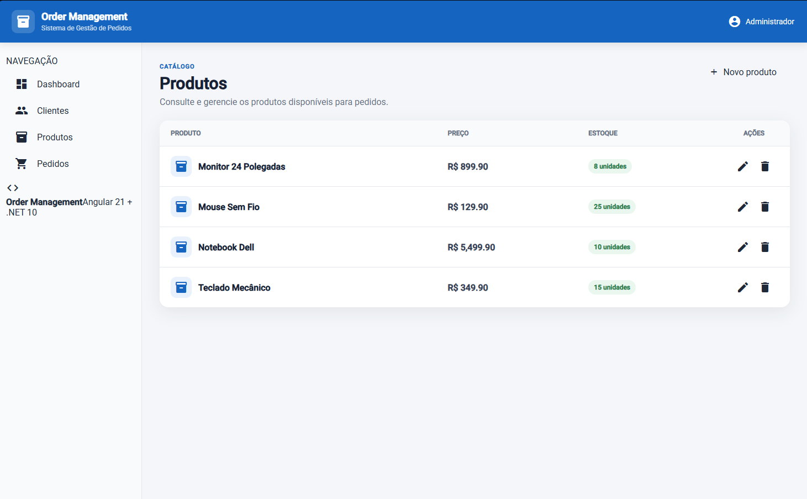
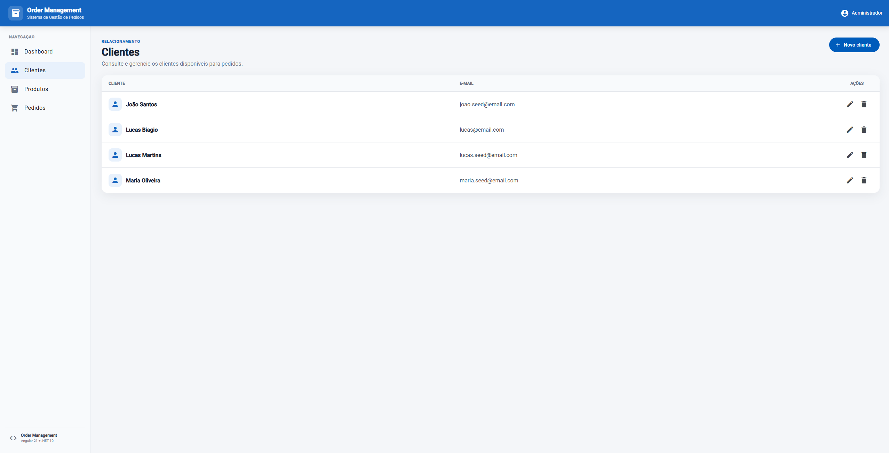
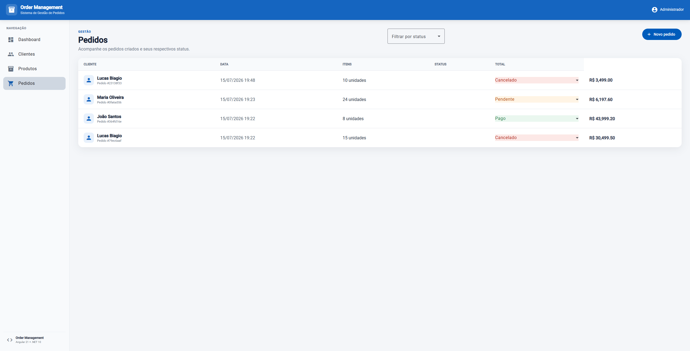
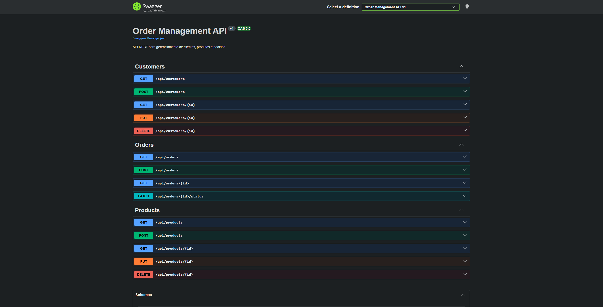

# 📦 Order Management System
> Technical Challenge Solution built with .NET 10, Angular 21 and Docker.


A complete Order Management System developed as a technical challenge using **.NET 10**, **Angular 21**, **Entity Framework Core**, **SQLite**, and **Docker**.

The project follows **Clean Architecture**, **SOLID principles**, automated testing, Docker Compose, and modern Angular development practices.

---

# ✨ Features

## Dashboard

- Business KPIs
- Total Customers
- Total Products
- Total Orders
- Orders by Status
- Latest Orders

---

## Customers

- Create Customer
- Edit Customer
- Delete Customer
- Customer Listing

---

## Products

- Create Product
- Edit Product
- Delete Product
- Stock Control

---

## Orders

- Create Orders
- Multiple Products per Order
- Automatic Stock Validation
- Automatic Stock Reduction
- Order Status Management
- Cancel Orders
- Automatic Stock Restoration after Cancellation
- Status Filtering

---

# 🏗 Architecture

```text
Angular 21

↓

REST API (.NET)

↓

Application Layer

↓

Domain Layer

↓

Infrastructure Layer

↓

SQLite Database
```

The backend follows **Clean Architecture**, separating business rules from infrastructure concerns.

---

# 🛠 Technologies

## Backend

- .NET 10
- ASP.NET Core
- Entity Framework Core
- SQLite
- AutoMapper
- FluentValidation
- Serilog
- xUnit

## Frontend

- Angular 21
- Angular Material
- Signals
- Reactive Forms
- RxJS
- Standalone Components
- Lazy Loading
- Vitest

## DevOps

- Docker
- Docker Compose
- Nginx

---

# 🏗 Architecture

```text
OrderManagement

├── frontend
│
├── src
│   ├── OrderManagement.Api
│   ├── OrderManagement.Application
│   ├── OrderManagement.Domain
│   └── OrderManagement.Infrastructure
│
├── tests
│
├── docker-compose.yml
│
└── README.md
```
### Backend Layers

- **API**: Exposes REST endpoints and handles HTTP requests.
- **Application**: Coordinates use cases, DTOs and business workflows.
- **Domain**: Contains business entities and rules.
- **Infrastructure**: Handles persistence, Entity Framework Core and external dependencies.

This separation keeps the business rules independent from infrastructure concerns and improves maintainability and testability.
---

# 🚀 Running with Docker

The first execution automatically:

- creates the SQLite database;
- applies Entity Framework Core migrations;
- seeds initial data;
- starts both backend and frontend containers.

```bash
docker compose up --build
```

The application will be available at:

| Application | URL |
|-------------|-----|
| Frontend | http://localhost:4200 |
| Swagger | http://localhost:8080/swagger |

The SQLite database is persisted using a Docker volume, so data is preserved between container restarts.

---

# 🚀 Running Locally

## Backend

```bash
dotnet restore

dotnet run --project src/OrderManagement.Api
```

## Frontend

```bash
cd frontend

npm install

ng serve
```

---

# 🧪 Running Tests

The project includes:

- Unit Tests
- Integration Tests
- Angular Component Tests

Backend

```bash
dotnet test
```

Frontend

```bash
ng test
```

Angular Production Build

```bash
ng build
```

---

# 📋 Business Rules

- Orders cannot be created with insufficient stock.
- Stock is automatically reduced when an order is created.
- Pending orders can be Paid or Cancelled.
- Cancelling a pending order automatically restores product stock.
- Paid and Cancelled orders cannot be modified.
- Dashboard information is updated based on persisted data.

---

# 🎯 Technical Highlights

- Clean Architecture
- SOLID Principles
- Repository Pattern
- Entity Framework Core
- SQLite
- Docker Compose
- Angular Signals
- Lazy Loading
- Responsive UI
- Snackbar Notifications
- Loading States
- Component Testing
- Integration Tests
- Unit Tests
- Exception Middleware
- Structured Logging with Serilog

---

# 📸 Screenshots

Business indicators and recent orders.

## Dashboard



## Products



## Customers



## Orders



## Swagger



---

# 🔮 Future Improvements

Given more time, I would implement:

- JWT Authentication
- Role-based Authorization
- Pagination
- Search and Sorting
- Soft Delete
- Audit Trail
- CI/CD Pipeline (GitHub Actions)
- OpenTelemetry
- Redis Cache
- End-to-End Tests
- Deployment to Azure or AWS

---

# 📝 Reflection

## Email notifications on order status changes

To implement email notifications, I would introduce an abstraction such as `IOrderNotificationService` in the Application layer.

The order status update use case would invoke this abstraction only after the transaction has been successfully completed, ensuring notifications are sent only when the data has been persisted.

The concrete email provider (SMTP, SendGrid, Amazon SES, etc.) would be implemented in the Infrastructure layer, keeping the Domain layer independent from external services and aligned with the Dependency Inversion Principle.

For a production environment, I would prefer an event-driven architecture. Instead of sending emails synchronously, the application would publish an `OrderStatusChanged` integration event to a message broker such as RabbitMQ or Azure Service Bus. A dedicated consumer would process the event and send the email asynchronously.

This approach improves scalability, resilience and user experience, while also enabling retries, monitoring and the future addition of new notification channels such as SMS, push notifications or webhooks without changing the core business logic.

---

# ✅ Technical Challenge Coverage

The solution includes:

- ✔ Customer Management
- ✔ Product Management
- ✔ Order Management
- ✔ Dashboard
- ✔ Stock Validation
- ✔ Automatic Stock Restoration
- ✔ Clean Architecture
- ✔ Docker Compose
- ✔ SQLite Persistence
- ✔ Unit Tests
- ✔ Integration Tests
- ✔ Angular Component Tests
- ✔ Responsive UI
- ✔ Lazy Loading
- ✔ Snackbar Notifications

---

# 👨‍💻 Author

Lucas Biagio

Backend Developer (.NET)